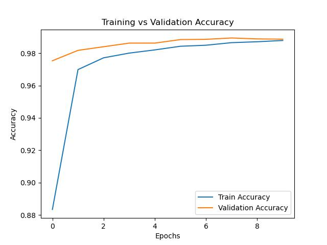

# Week 2 Assignment – Machine Learning Fundamentals with CNN (MNIST)

This assignment focused on classifying handwritten digits from the **MNIST dataset** using a **Convolutional Neural Network (CNN)** built with `TensorFlow`, `NumPy`, and `Matplotlib`.

---

## 📌 Why CNNs Over Traditional Models?

Traditional models like **SVM** and **Random Forests** treat every pixel as an independent feature, ignoring spatial patterns. In contrast, **CNNs** are tailored for image data — they capture **local structures** (edges, corners, shapes) using convolutional filters, which leads to significantly better performance.  
> ✅ CNNs achieved ~**99.00% accuracy**, whereas traditional models typically reach only 96–98%.

---

## 🧠 Role of Non-Linear Activations

We used **non-linear activation functions** (like `tanh`, `relu`, and `sigmoid`) to help the model learn **complex patterns**. Without non-linearity, the network would behave like a linear model and fail to capture real-world relationships.

---

## 🛠️ Model Architecture Design

We experimented with:
- Different **convolutional layers** (varying filter counts and sizes)
- Multiple **activation functions** (`tanh`, `relu`, `sigmoid`)
- Both **max** and **average pooling**
- Use of **Dropout** to prevent overfitting

The final model had **two convolutional blocks**, followed by a dropout layer and two dense layers. This structure balanced complexity and efficiency.

---

## ⚙️ Optimizer & Training Strategy

We tested multiple optimizers (`SGD`, `Adam`, `RMSprop`) and loss functions (`categorical crossentropy`, `categorical hinge`, etc.).

### ✅ Best Combination:
- **Optimizer**: `Adam` with learning rate `0.001`
- **Loss**: `categorical_hinge` (after testing several)
- **Epochs**: 10
- **Batch Size**: 64
- **Validation Split**: 0.2

Adam's adaptive learning rate enabled faster convergence and better validation performance.

---

## 📈 Performance

- **Final Test Accuracy**: **0.9900**
- Accuracy trends during training are visualized in the figure below:

---

## 🛡️ Overfitting Mitigation Techniques

To reduce overfitting, we applied:
- ✅ **Dropout layers**
- ✅ **Data augmentation** (optional)
- ✅ **Early stopping** (optional)
- ✅ **L2 regularization** (optional)

---

## ✅ Conclusion

This experiment highlighted how CNNs, when combined with appropriate activations, architectural tuning, and optimizers, excel at image classification tasks like MNIST. The model achieved **99.00% test accuracy** with strong generalization performance.

